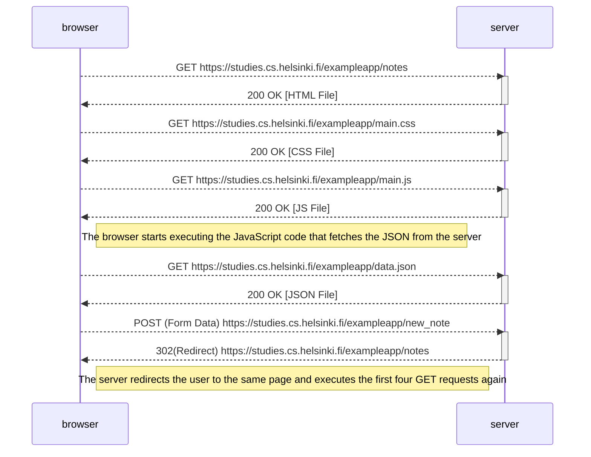

```mermaid
sequenceDiagram
    participant browser
    participant server

    browser -->> server: GET https://studies.cs.helsinki.fi/exampleapp/notes
        activate server
        server -->> browser: 200 OK [HTML File]
        deactivate server

    browser -->> server: GET https://studies.cs.helsinki.fi/exampleapp/main.css
        activate server
        server -->> browser: 200 OK [CSS File]
        deactivate server

    browser -->> server: GET https://studies.cs.helsinki.fi/exampleapp/main.js
        activate server
        server -->> browser: 200 OK [JS File]
        deactivate server

        Note right of browser: The browser starts executing the JavaScript code that fetches the JSON from the server

    browser -->> server: GET https://studies.cs.helsinki.fi/exampleapp/data.json
        activate server
        server -->> browser: 200 OK [JSON File]
        deactivate server
    
    browser -->> server: POST (Form Data) https://studies.cs.helsinki.fi/exampleapp/new_note
        activate server
        server -->> browser: 302(Redirect) https://studies.cs.helsinki.fi/exampleapp/notes
        deactivate server
        Note left of server: The server redirects the user to the same page and executes the first four GET requests again
```
