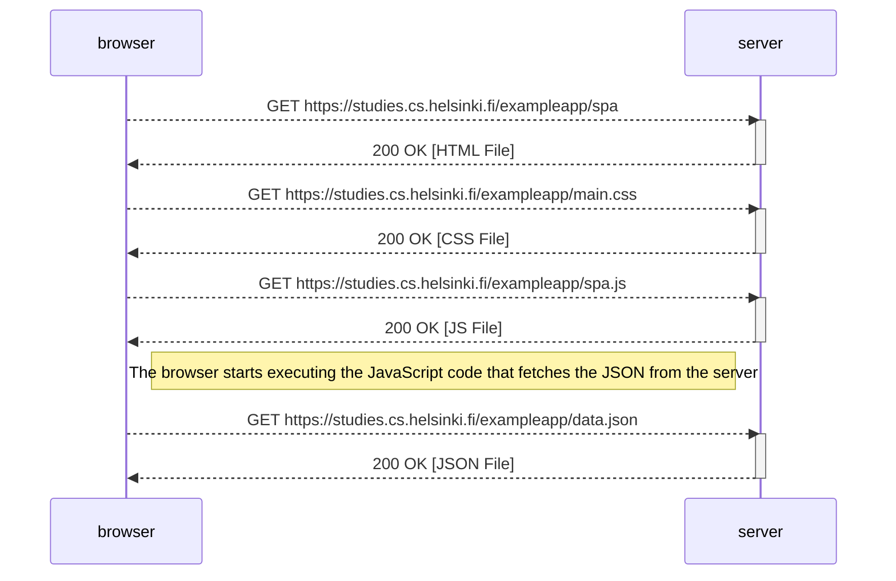

```mermaid
sequenceDiagram
    participant browser
    participant server

    browser -->> server: GET https://studies.cs.helsinki.fi/exampleapp/spa
        activate server
        server -->> browser: 200 OK [HTML File]
        deactivate server

    browser -->> server: GET https://studies.cs.helsinki.fi/exampleapp/main.css
        activate server
        server -->> browser: 200 OK [CSS File]
        deactivate server

    browser -->> server: GET https://studies.cs.helsinki.fi/exampleapp/spa.js
        activate server
        server -->> browser: 200 OK [JS File]
        deactivate server

        Note right of browser: The browser starts executing the JavaScript code that fetches the JSON from the server

    browser -->> server: GET https://studies.cs.helsinki.fi/exampleapp/data.json
        activate server
        server -->> browser: 200 OK [JSON File]
        deactivate server
```
